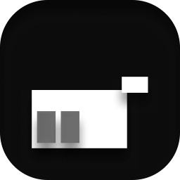

<div align=center>
  
</div>
<h2 align="center">
Obscura Browser Agent
</h2>
<h2 align="center">
Astrbot Plugin
</h2>
<h2 align="center">
Astrbot 插件 - Obscura 浏览器代理
</h2>


<div align="center">
💖 一款为 AstrBot 框架中的 Bot 提供无头浏览器的插件，允许大模型自由操作、搜索和浏览网页 😎
</div>
<div align="center">
⚡ Powered By Obscura 🚀
</div>
<div align="center">
由 POINTER 用 ❤️ 制作
</div>


<div align="center">
[中文 README](README.md) | [English README](README_en.md)
</div>


> [!NOTE]
> 本插件为自用插件
>
> 本插件即将上架 AstrBot 插件市场
>
> 本插件项目因为以上原因，可能无法及时响应和解决 Issues 和 PR

## 主要功能和特色

- 🔍 **支持多种开箱即用的搜索引擎**：支持 DuckDuckGo HTML（默认）、AnySearch API、exa API、Perplexity API、Tavily API. 当然还可以自定义搜索 URL.
- ⚡ **轻量，高性能**：基于 Obscura，按需在后台调用 CLI，无需运行常驻的浏览器服务实例。
- 📄 **深度网页解析**：不仅能够提取网页正文，还能提取 OpenGraph 元数据、标题层级、导航标签，以及基础的 CSS 颜色和字体 Token。
- 👁️ **媒体与视觉支持**：支持提取网页图片 URL、替代文本 (alt text) 和图注。配置好描述模型后，可以尝试理解网页上的图片内容。
- 🛡️ **安全机制**：默认拦截非 HTTP 协议 URL、localhost 以及私有/保留 IP，保障宿主机网络安全。
- 🔮 **Web UI**: 支持通过 Web UI 管理 Obscura 的环境.

## 安装

前往 AstrBot Web UI - 插件 - 右下角 "+" 号 - 从链接安装，填入本仓库的 URL 即可安装。

## 使用

插件安装成功并启用后，默认处于**混合触发模式**：
- 你可以像日常聊天一样问问题，模型如果觉得有需要，会主动调用浏览器并在需要时执行搜索。
- 也可以通过 AstrBot 指令或强制触发词进行搜索：
  ```text
  /搜索 AstrBot 插件开发
  /search AstrBot plugin development
  搜索 https://example.com 并总结这个网页
  ```

## 支持开箱即用的搜索引擎

本插件内置了对多种开箱即用的搜索引擎，可以在配置页面轻松切换：

- **DuckDuckGo HTML**（免费）【默认】
- **Bing RSS**（免费）
- **AnySearch API**（免费）
- **博查 API**
- **exa API**（免费）
- **parallel API**
- **Perplexity API**
- **Tavily API**（免费）
- **自定义搜索 URL**（可自定义）

## 插件配置说明

在 AstrBot Web UI 中打开本插件的设置页面，您可以对如下功能进行微调：

### 普通配置

- ⚙️ 通用
- 🕹️ 强制触发
- ✨🎯 强制触发模式相关详细配置
- 🌐 浏览器操作和搜索
- 🖼️ 网页媒体
- 🚀 高级

以上具体请查看 AstrBot 插件配置中的说明

### 下载 Obscura 二进制文件

> 此为安装 Obscura 浏览器的相关说明

#### Web UI

按 UI 指示操作

#### CLI

按文字提示操作

#### 手动

首先，你需要手动下载 Obscura:

[Releases · Obscura](https://github.com/h4ckf0r0day/obscura/releases)

然后你有以下三种方案可以手动安装 Obscura:

- 在本插件目录下放入 `obscura/obscura.exe` 或者 `obscura/obscura`
- 把 `obscura.exe` 或者 `obscura` 添加进系统的环境变量
- 指定一个绝对路径

### 自定义提示词

#### ✨ main_bot 模式

用户明确要求使用 Obscura 浏览器能力。下面是通过 Obscura 得到的证据，请结合当前人格、上下文和用户原始问题回答。

要求：
1. 优先依据浏览器证据回答。
2. 不要把证据之外的推测说成事实。
3. 如证据不足或浏览失败，请按当前对话风格说明。
4. 如果引用来源，可以使用 [1]、[2] 这样的编号。

总结侧重点：{summary_focus}

用户需求：
{query}

浏览器证据：
{evidence}

#### 🎯 direct_reply 模式

你是一个严谨的联网浏览助手。请基于下面的 Obscura 浏览器材料回答用户问题。

要求：
1. 优先使用浏览器材料，不要把没有依据的内容说成事实。
2. 结论后用 [1]、[2] 这样的编号标注来源。
3. 如果材料不足，请明确说明不足，并给出已找到的信息。
4. 如果材料包含图片或设计线索，请区分“页面文字/DOM 元数据能确认的内容”和“无法直接确认的视觉细节”。
5. 用用户提问的语言回答，保持简洁但覆盖关键事实。

总结侧重点：{summary_focus}

用户问题：
{query}

浏览器材料：
{evidence}

## 插件安装位置

Windows: `%USERPROFILE%\.astrbot\data\plugins\astrbot_plugin_agent_browser`

Linux / macOS / OpenHarmony: 请根据 AstrBot 部署方式查找对应的目录

## Q/A

如果碰到一些奇怪的 Bug, 建议先重启 AstrBot 的后端。

如果本插件的 WebUI 无法正常与后端通信，一般重启 AstrBot 的后端就可以解决。

## 感谢

[Dependencies](https://github.com/jin6yang/astrbot_plugin_agent_browser/network/dependencies)

[AstrBot✨](https://github.com/AstrBotDevs/AstrBot)

[Obscura](https://github.com/h4ckf0r0day/obscura)

## 开发支持

- [AstrBot Repo](https://github.com/AstrBotDevs/AstrBot)
- [AstrBot Plugin Development Docs (Chinese)](https://docs.astrbot.app/dev/star/plugin-new.html)
- [AstrBot Plugin Development Docs (English)](https://docs.astrbot.app/en/dev/star/plugin-new.html)

## 许可证


